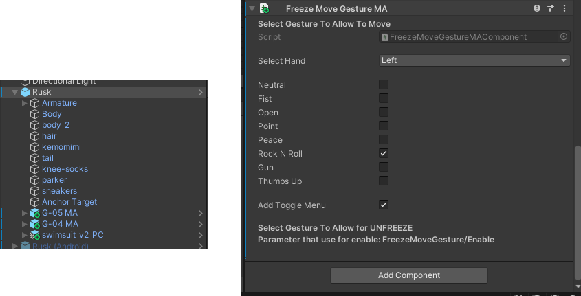

# ❄️ Freeze Move Gesture MA

Freeze Move Gesture MA helps prevent controller drift by freezing movement gestures. It’s a simple and effective solution to ensure your avatar's gestures stay precise during use.

## How to Use

1. **➕ Add the Script**: Attach the script to your avatar's root object.
2. **✅ Enable the Option**: Check the option in the script to use the freeze move gesture feature.
3. **🛠️ Custom Menu**:
    - If you prefer to create your own custom menu, uncheck the `AddToggleMenu` option.
    - Use the boolean parameter `FreezeMoveGesture/Enable` in your menu to control the freeze feature.

For a visual guide, please refer to the image below:

## 💖 Support Me

If you enjoy using this tool and would like to support me, feel free to visit my [SweetForest's Booth](https://sweetforest.booth.pm). Your support is greatly appreciated!
